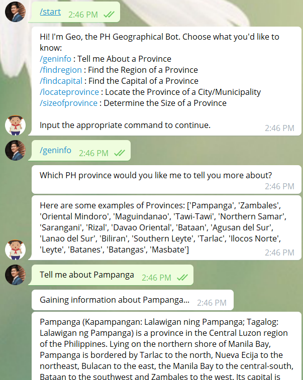

# Sprint4_GeoTheChatbot
Code for the creation of Geo, a simple PH Geography Chatbot using Telegram API.

Our group (Team Julia) composed of myself (Nox), Gab, [Jelly](https://github.com/jeareyes17) and JB were tasked to create a chatbot to teach Philippine teenage high school students about Philippine geography using [spaCy](https://spacy.io/), a free open-source library on Natural Language Processing in Python.

For our group's presentation on this Chatbot project, please refer to this [link](https://docs.google.com/presentation/d/1tF5_WQFpwb23qmKQDkpbiX5nPhEYkkclJQIjGlESbcI).

<b> NOTE: You will need to provide your own Telegram Bot API Token to get this to work. Please refer to this [link](https://core.telegram.org/bots) for more information regarding Telegram Bot API Tokens. 
 
Please refer to line 363 in the notebook and revise the line of code to reflect your personal Telegram Bot API Token: </b>
```python
def main():
    updater = Updater("INSERT TELEGRAM API TOKEN HERE", use_context=True)
```

# Required Files
1. [df_consov2.csv](df_consov2.csv) - This contains the complete PH Municipality to PH Province lookup list, which is required for Geo the PH Geography Chatbot to function properly. Place it in the same directory as the jupyter notebook with the complete code.

2. [Customer NER model trained using spaCy](https://drive.google.com/file/d/1xAZ7Juz030esYQUiuAXpw5Z6fLFzUdTw/view) - This 40MB file contains the custom trained Named Entity Recognition Model for spaCy and it is used to teach the Chatbot about the specific Philippine provinces and municipalities so it can properly identify them as such. Download the file and place the folder in the same directory as the jupyter notebook with the complete code.

# Chatbot Functionalities
1. <b> /geninfo </b> - Ask about a province and the Chatbot will look it up on Wikipedia and provide a few sentences to describe it.
2. <b> /findregion </b> - Ask about a province and the Chatbot will return the corresponding region where it is located.
3. <b> /findcapital </b> - Ask about a province and the Chatbot will return the corresponding capital of the province.
4. <b> /locateprovince </b> - Ask about a municipality and the Chatbot will return the corresponding province where it is located.
5. <b> /sizeofprovince </b> - Ask about a province and the Chatbot will provide the land area (in square km and in square miles) of the province.



*Special thanks to [Eskwelabs](https://www.eskwelabs.com/) and our instructor [Bash Yumol](https://github.com/albertyumol)!*
